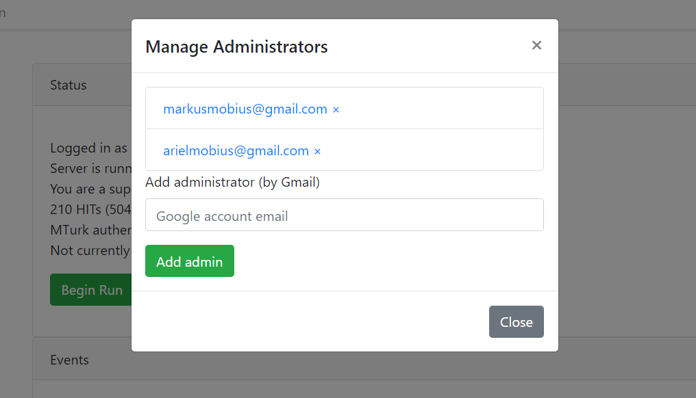
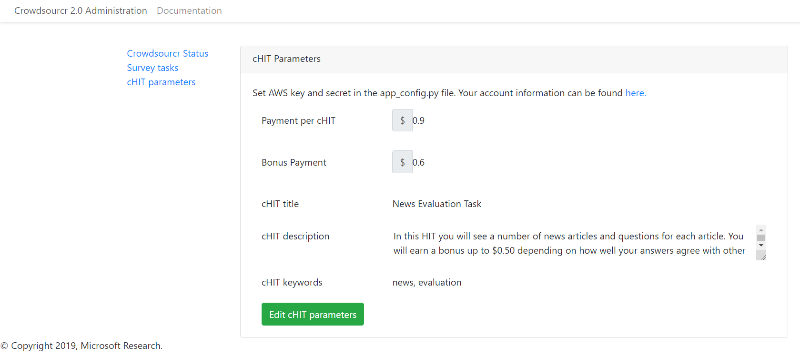

Administration
==============

Once Crowdsourcr is installed and running, there are two important
URLs.  The first is
::

  http://YOUR.DOMAIN

which has this online documentation for Crowdsourcr, and the other is
::

  http://YOUR.DOMAIN/admin/

which is the main administrative panel.  You will be redirected to
Google for authentication.  Crowdsourcr asks for your identity so
that it can record who begins and ends HITs for accountability.

You may find that Crowdsourcr does not let you see the Admin panel.
If this happens, check ``config/app_config.py`` to see that your
Google account is indeed in the superadmins list.  Worse, you may find
that Google is not wanting to authenticate.  If this happens, make
sure you followed the instructions in :ref:`google configuration` exactly.

Admin panel
-----------

You can get to the admin panel using the URL similar to
``http://YOUR.DOMAIN/admin/``.  When there is a Mechanical Turk run,
the interface will look something like the following:

.. figure:: ../doc_img/crowdsourcer_admin_main.png
   :align: center

The admin page has three tabs:

- The status tab (default view) allows management of administrators and an overview of loaded cHITs and Amazon Turk progress.
- The survey tab allows upload of new surveys and download of data.
- The cHit tab describes the Amazon Turk task as well as reward and bonus info.

We describe the three tabs in detail below.

Status Tab
++++++++++

The status tab tells you whether the system is running in ``development`` or ``production``
mode, whether you are a superadmin (and a link to the `Superadmin panel`_), how many cHITs and tasks are loaded and completed,
information about your Mechanical Turk account (if valid account credentials were provided in the configuration file), as well as the HIT id for the current HIT (if one is
currently running).

Whenever surveys are uploaded and posted to Amazon Turk, an entry is recorded in the Events area.  These events are persisted between sessions and jobs.

If a Mechanical Turk account has been provided in ``config/app_config.py`` the task tab will show one of two buttons: "Begin Run" or "End Run."

Begin Run
  Publishes a HIT on Amazon Mechanical Turk.  The cHITs shown at the bottom of the `Survey Tab`_ will be assigned
  to the MTurk workers as they visit your Crowdsourcr installation. The published HIT will have exactly as many
  assignments as there are uncompleted cHITs.  Beginning a run does not clear the database of prior responses; this is accomplished by
  uploading an XML file again.

End Run
  Expires the HIT on Amazon Mechanical Turk and computes and pays out
  bonuses (if applicable).

In both cases, an event will be recorded and show up in the events area at the bottom of the status tab.

Superadmin panel
----------------

If you are a superadmin, a link with the text "Administer admins" will
appear in the status area of the admin panel.  This modal popup lets you add
Google accounts which should be able to access the admin panel.
Whenever a superadmins visits the admin panel, they are automatically
added to the list of admins.

.. _survey_tab:

Survey Tab
++++++++++

.. figure:: ../doc_img/crowdsourcer_admin_surveytab.png
   :align: center

The format for a Crowdsourcr run description is XML as described in :ref:`xml-format`.

Upload XML
  If there is no ongoing run on Amazon Turk, then this button will be enabled.
  Select a Crowdsourcr XML file and click "Upload XML" to upload a
  job description.  This operation will also clear all prior results
  from the database, so make sure to use the following download
  buttons *before* uploading a new XML file.

Download current data
  At any point (even during an ongoing run), you may download the
  resulting data from the job.  The output format is described in this
  document.

Download bonus info
  After ending a run and after the bonus info has been computed, this
  button will be enabled and it will contain JSON describing all of
  the awarded bonuses.

Note that the only way to run an experiment again is to re-upload the
XML, as this is the only way to clear the database (except for using
the ``--drop`` option, described in section :ref:`running`).

When an XML file has been uploaded, the bottom area of the survey tabis populated with all of
the cHITs described in that file.  When an MTurk worker accepts the
published HIT, they are directed to ``http://YOUR.DOMAIN/HIT/``, where
they are assigned one of these cHITs.

Each cHIT is formatted based on if it is being worked on or if it has
been completed.  It should be clear form experience which formatting
style corresponds to HITs that no one is working on, that someone is
working on, and that have been completed.  At the time of writing,
though, the formats were orange normal, red bold, and green italics,
respectively.

Note that if another admin uploads a new XML file, this area will not
be updated.  You must refresh the page.

Upon clicking on a cHIT, a Tasks section appears just below which
shows all of the tasks inside that cHIT.  When clicking on any of the
tasks, you can see what an MTurk worker would see for that task.  When
clicking on "Show HIT" in this Tasks section, the cHIT is reserved for
you and you may take the cHIT yourself, recording the data in the
database (here, "reserve" means that no other worker will be assigned
this cHIT unless the system automatically releases the assignment
because it goes "stale").  The URL for these "Show HIT" links can be
given to anyone if you want them to take a particular cHIT.

cHIT Tab
++++++++

To be able to publish a HIT onto Amazon Mechanical Turk, you must have
entered the Access Key and the Secret Key for your account into ``config/app_config.py``.

Click the "Edit cHIT parameters" button to open a modal where you can 
modify how a cHIT is advertised as an Amazon Turk HIT. While there is an ongoing Amazon Turk run the edit cHIT run will be disabled.

You can specifically modify the following parameters:

- base reward 
- bonus amount
- HIT title 
- HIT description
- HIT keywords

The bonus amount determines the maximum bonus a worker receives:

- A worker can earn "bonus points" for certain tasks. The bonus points are defined in the XML of the survey and details are described in section :ref:`bonus`.
- A question will earn maximum bonus points if all other workers who answered the question provided the same answer.
- A worker can earn partial which is increasing with the number of other workers who provide the same answer (details are defined in section :ref:`bonus`).
- Crowdsourcr calculates the share of bonus points earned among total possible points.
- This shares is multiplied by the bonus amount in the cHIT Tab and determines the actual bonus paid to a worker.

Note, that if questions are assigned to only one worker in the XML then the bonus will always be zero.