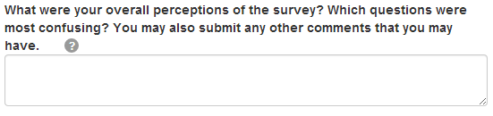
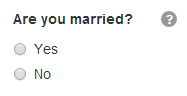

XML Format
==========

This section describes the structure of the XML file used for
describing an experiment (see :ref:`admin upload` for how to upload the XML file
to Crowdsourcer).

The main structure of the XML file is as follows:
::

 <xml>
   <modules>
     ... module definitions ...
   </modules>
   <tasks>
     ... task definitions ...
   </tasks>
   <hits>
     ... hit definitions ...
   </hits>
   <documents>
     ... document definitions ...
   </documents>
 </xml>

The ``documents`` section is optional if it is empty, otherwise the
first three are required.

Modules
-------

A module has an internal name, a visible header, and a list of
questions:
::

 <module>
   <name>module_name</name>
   <header>Visible Module Header</header>
   <questions>
     ... question definitions ...
   </questions>
 </module>

Questions
---------

There are a few types of questions which have been defined.  The
general format for a question definition is
::

 <question>
   <varname>internal_variable_name</varname>
   <questiontext>Visible question text</questiontext>
   (<helptext>Optional help text</helptext>)
   <valuetype>some_value_type</valuetype>
   ...
 </question>

The variable name is for determining how the answer is recorded into
the response data.  The value type determines how the question is
rendered.

Numeric questions
+++++++++++++++++

A numeric question (value type ``numeric``) displays as a text box
that only accepts a number.  An example:

.. figure:: ../doc_img/crowdsourcer_numeric.png
   :align: center

::

 <question>
   <varname>age</varname>
   <valuetype>numeric</valuetype>
   <questiontext>What is your age?</questiontext>
   <helptext>This is your age in years.</helptext>
 </question>

Text questions
++++++++++++++

A text question (value type ``text``) displays as a text box that
accepts any non-empty textual content.  An example:

::

 <question>
   <varname>thoughts</varname>
   <valuetype>text</valuetype>
   <questiontext>What were your overall perceptions of the survey?
     Which questions were most confusing? You may also submit any
     other comments that you may have.</questiontext>
   <helptext>We want to better understand the strenghts and weaknesses
     of our survey in order to improve it for future workers. Your
     answer to this question will not influence your
     payment.</helptext>
  </question>

Categorical questions
+++++++++++++++++++++

A categorical question (value type ``categorical``) displays as a set
of radio buttons that accepts exactly one response.  An example:

::

 <question>
   <varname>married</varname>
   <questiontext>Are you married?</questiontext>
   <helptext>Please answer metaphorically.</helptext>
   <valuetype>categorical</valuetype>
   <content>
     <categories>
       <category>
         <text>Yes</text>
         <value>yes</value>
       </category>
       <category>
         <text>No</text>
         <value>no</value>
       </category>
     </categories>
   </content>
 </question>

The ``text`` element holds what is shown to the worker, and the
``value`` element holds what is recorded to the database for that
categorical response.

Nested categorical questions
++++++++++++++++++++++++++++

For some questions, it is better to show categorical options
hierarchically.  The syntax is exactly the same for ``categorical``
questions, except that the ``text`` elements hold ``|``-separated
options.  The responses will be shown in a tree-like fashion.  An example:

.. figure:: ../doc_img/crowdsourcer_categorical_nested.png
   :align: center

::

 <question>
   <varname>level_category</varname>
   <valuetype>categorical</valuetype>
   <questiontext>What is this category?</questiontext>
   <content>
     <categories>
       <category>
         <text>Hard|Science|Interesting</text>
         <value>hard_science_interesting</value>
       </category>
       <category>
         <text>Hard|Law</text>
         <value>hard_law</value>
       </category>
       <category>
         <text>Hard|Science|Difficult</text>
         <value>hard_science_difficult</value>
       </category>
       <category>
         <text>Hard|Science|Boring</text>
         <value>hard_science_boring</value>
       </category>
       <category>
         <text>Soft|Animals</text>
         <value>soft</value>
       </category>
     </categories>
   </content>
 </question>

It is possible to have optional specificity.  For example, if we added
a category with text ``Soft|Animals|Teddy Bear`` to the above
definition, then a user could answer either ``Soft|Animals`` or the
sub-category ``Soft|Animals|Teddy Bear``.

Scale questions
+++++++++++++++

For some categorical questions, the options are along a scale that is
best presented horizontally.  This is specified using the
``horizontal`` layout in the ``options`` element for the question.  An
example:

.. figure:: ../doc_img/crowdsourcer_scale.png
   :align: center

::

 <question>
   <varname>bias</varname>
   <valuetype>categorical</valuetype>
   <questiontext>How biased is this?</questiontext>
   <options>
     <layout>horizontal</layout>
     <lowLabel>Conservative</lowLabel>
     <highLabel>Liberal</highLabel>
     <outsideCategories>N/A</outsideCategories>
     <outsideCategories>Unsure</outsideCategories>
   </options>
   <content>
     <categories>
       <category>
         <text>1</text>
         <value>1</value>
       </category>
       <category>
         <text>2</text>
         <value>2</value>
       </category>
       <category>
         <text>3</text>
         <value>3</value>
       </category>
       <category>
         <text>4</text>
         <value>4</value>
       </category>
       <category>
         <text>5</text>
         <value>5</value>
       </category>
       <category>
         <text>6</text>
         <value>6</value>
       </category>
     </categories>
   </content>
 </question>

Conditional Questions
---------------------

The display of questions can be made conditional on the answer to other 
questions by specifying a ``<condition>``:

::

 <question>
   <varname>article_type_categorial</varname>
   <questiontext>What kind of article is this?</questiontext>
   <valuetype>categorical</valuetype>
   <content>
     <categories>
       <category>
         <text>News article</text>
         <value>news</value>
       </category>
       <category>
         <text>Editorial</text>
         <value>editorial</value>
       </category>
       <category>
         <text>Other</text>
         <value>other</value>
       </category>
     </categories>
   </content>
 </question>
 <question>
   <varname>article_type_other</varname>
   <questiontext>What other kind is it?</questiontext>
   <valuetype>text</valuetype>
   <condition>article_type_categorial==other</condition>
 </question>

The condition must be either an equality (``==``) or an inequality 
(``!=``) with the ``varname`` of another question on the left-hand
side and a valid ``value`` for that question on the right-hand
side.

When specified, the question will only be shown to Turkers if the condition
is satisfied.

Bonus
---------

Crowdsourcer can automatically award bonuses conditional on agreement 
between Turkers on each task. This allows one to reward Turkers for good
performance in multiple entry tasks.

Internally crowdsourcer uses ``bonus points`` as a currency, which are 
translated into a dollar amount after the conclusion of a run. The maximal
dollar bonus payment can be specified in the admin interface. After a run
is finished crowdsourcer will tally up the number of bonus points awarded
for each question and the number of bonus points that could have been 
awarded, divide the two and pay out a bonus that's proportional to the
share of bonus points actually awarded.

Specifying a bonus
++++++++++++++++++

Bonuses can be specified on a per-question basis by adding a ``<bonus>``
element to the XML file. By default the maximal number of bonus
points awarded per question which has an associated ``<bonus>`` will be
one. This can be changed by adding a ``<bonuspoints>`` element.

::

 <question>
   <varname>article_type_categorial</varname>
   <questiontext>What kind of article is this?</questiontext>
   <valuetype>categorical</valuetype>
   <content>
     <categories>
       <category>
         <text>News article</text>
         <value>news</value>
       </category>
       <category>
         <text>Editorial</text>
         <value>editorial</value>
       </category>
       <category>
         <text>Other</text>
         <value>other</value>
       </category>
     </categories>
   </content>
 </question>
 <question>
   <varname>article_type_other</varname>
   <questiontext>What other kind is it?</questiontext>
   <valuetype>text</valuetype>
   <bonus>threshold:50</bonus>
   <bonuspoints>2</bonuspoints>
 </question>

Bonus schemes
+++++++++++++++

Two kinds of bonus schemes are available:

- linear: a number of bonus points that's a linear function of the share
  of other Turkers who gave the same answer to the task. To use this scheme
  add ``<bonus>linear</bonus>`` to the XML specification
- threshold: an all-or-nothing scheme where the bonus is awarded only if
  the share of Turkers who gave the same answer to the task (weakly 
  exceeds a threshold. To use this scheme add 
  ``<bonus>threshold:50</bonus>`` to the XML specification.

Bonus calculation
+++++++++++++++++

As described above, crowdsourcer will tally up the number of bonus
points awarded for each question according to the specified scheme,
tally up the number of bonus points that could have been awarded, 
divide the two and pay out a bonus that's proportional to the
share of bonus points actually awarded.

Bonuses will never be awarded for conditional questions whose condition
is not satisfied. However, these questions will enter the calculation of
potential bonus points.

